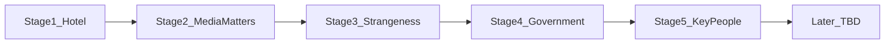

# Stage journey

Source of truth for how Vacancy opens systems over time. **Do not remap
`state.Stage` or act keystones until a later pass asks for that work.**

**Rule:** acts define *story* (mood, radio/paper tone, hint pools). Stages
define *when a system becomes the player's job*.

Play Stage 1 as the motel. Leave Story / Media / Shelter catalogs as they are
until the remap checklist at the bottom is executed.

## Two ladders (do not confuse them)

| Ladder | What it is now | What it should become |
|--------|----------------|------------------------|
| `state.Stage` in `Assets/Scripts/Systems/Stage.cs` | `1` until tutorial **and** Room 7, then `2` unlocks all collapse systems at once | Stages **1–5+**. Tutorial + Room 7 stay a *Stage 1 completion* gate, not “the rest of the game.” |
| `state.Story.Act` in `Assets/Scripts/Systems/Story.cs` | `normalcy` → `unease` → `disruption` → `collapse` → `shelter`, and keystones also turn on systems (shelter SKUs, barricades) | Acts stay labels, radio/paper tone, hint pools. Stop using act changes as the only system switch. |

Today `Story.Update` and `Arrivals.PickKind` treat `Stage == 2` as “story is
live”: travelers-only ends, desk questions appear, marked guests and
`wrong` / `survivor` mix start. That dump is the opposite of a smooth arrival.

The repo root `README.md` still describes the old five-act / system-unlock
table. Update that table when the remap ships so it does not contradict this
file.

## Smooth arrival

- **Tease before it counts.** The object exists a stage early as flavor (lobby radio already plays weather in Stage 1 via `Media.Stage1Stories`).
- **One surprise proves the system.** Stage 2’s job is a single event that makes radio/paper *useful*, not a catalog dump.
- **Consequences land late.** Keep the delayed-wrong-guest pattern (fail the next night, not at the desk).
- **Callbacks, not new lore dumps.** Stage 4’s government beat should name or describe people you already checked in or turned away.
- **No calendar-only jumps.** Keep day *and* something the player did. Move those checks onto **stage** ids later, not act names.

## Stage 1 — The inn

**Player fantasy:** You run a motel. You learn who *you* are by doing the job.

**Systems that are the job:** drive-in / desk PC admit-refuse, rooms, supplies,
hire, vacancy pole, phone requests, stay walkabouts, inspect/clean/repair,
local save/load.

**Story (act only):** Quiet-season paper and radio. No questions that matter.
All arrivals are travelers (`Arrivals.PickKind` already does this while
`IsStageOne`).

**Exit (already coded, keep):** tutorial checklist **and** 7th room
(`Stage.MaybeAdvance`). Banner can stay “this is no longer only a hotel,” but
that must **not** unlock shelter SKUs or `wrong` guests.

**Do not add here later:** humanity, government, night raids.

## Stage 2 — The news starts to matter

**Player fantasy:** Paying attention to the lobby is part of the job.

**Systems that turn on:** radio/paper become *evidence* — unread paper still
hides useful desk questions (`Media.cs` / `Stage.PaperReadLog`). Asking
questions at the desk starts to change what you know.

**Surprise event (not built):** One guest’s story only makes sense if you heard
last night’s bulletin or read the extra fact in the paper. Wrong recitation vs
paper-only detail is the intended trap. Stage 2 is when that trap is *taught*,
once, clearly.

**Story:** Still mostly a hotel. Hints can lean “roads quieter,” supplier late —
mood only.

**Exit sketch:** Player has used radio *or* paper in a desk decision (or ignored
it and felt the miss). Then Stage 3 may start mixing odd arrivals.

## Stage 3 — The world is wrong

**Player fantasy:** Guests are not all guests. Choices have delayed teeth.

**Systems that turn on:** `wrong` (and a little later `survivor`) mix; damning
vs innocuous signs; marked tells; overnight consequences already sketched in
`Arrivals.cs` / pending threats in `Story.cs`.

**Story:** Unease / early disruption *tone* — glow wrong color, phones flaky —
without unlocking the office-PC shelter aisle yet.

**Exit sketch:** A visible consequence the player can connect to a specific
admit/refuse, then the road gets official.

## Stage 4 — Someone is looking

**Player fantasy:** This is not only your problem. There is a hunt, and you
already housed some of the hunted.

**Systems that turn on:** a **government / official** beat (new — not in current
keystones). Could be a radio address, a paper notice, or a person at the desk
who is not a guest. They describe odd events you already lived and ask about
*names or rooms you actually used*.

**Story:** Conspiracy *sense*, not a lore lecture. Officials are tracking
something; your register is evidence.

**Do not do yet:** full faction sim, wanted posters as a minigame. One encounter
+ follow-up media is enough.

**Exit sketch:** You understand that some past guests were “persons of
interest,” and that changes how you look at the next ones.

## Stage 5 — People who matter

**Player fantasy:** A few arrivals are not inventory. They change the house.

**Systems that turn on:** **humanity** as something you feel (score already
exists on `StoryState`; it barely drives play). Recurring or named characters
who affect tenants and teach *what to watch for next* (behavior, tells, who you
protect).

**Story:** Odder events, but still an inn with a register — not “rooms are
bunks” yet.

Root README “next steps” (humanity branches, survivors who work, endings)
belong *from here forward*, not in Stage 1.

## Later (not specified yet)

Old acts **collapse** and **shelter** (barricades, shelter SKUs on the office
PC, rooms-as-bunks, `Shelter.cs`) stay **after** Stage 5 unless that changes.
More stages can append.

---

## Remap checklist (do not run until asked)

When a later pass implements gates, do this in Unity only (`Assets/Scripts/`).
Do not treat `IsStageOne` as “story is live.”

1. Split `state.Stage` into **1–5+**. Tutorial + Room 7 complete Stage 1 only;
   `MaybeAdvance` must not dump `wrong` guests, desk evidence questions, or
   shelter SKUs.
2. Replace `Stage.IsStageOne` call sites with explicit stage checks:
   - `Story.Update` / `Story.Hook` — keystones fire per **stage**, not “not stage 1.”
   - `Arrivals.PickKind` — travelers only in Stage 1; `wrong` from Stage 3;
     `survivor` later in 3, not at the old Stage 2 dump.
   - `Media` — Stage 1 weather catalog stays; evidence questions from Stage 2.
   - `Story.MaybeMarkArrival` — marked tells from Stage 3.
3. Move system unlocks **off** act keystones onto matching stages:
   - `advance-disruption` unlocking shelter SKUs → not Stage 2–5; keep after 5
     unless the later-stages design says otherwise.
   - `advance-collapse` activating defense → same, after Stage 5.
4. Keep acts as `ActLabels` + hint/media `MinAct` tone only.
5. Write Stage 2’s one teaching incident and Stage 4’s government callback
   against *saved guest names / rooms*.
6. Update root `README.md` so the old act/system table matches this file.
